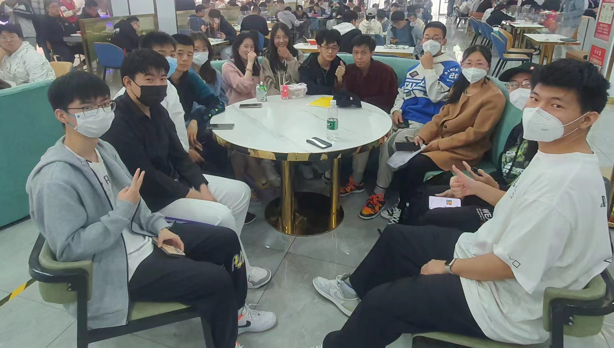
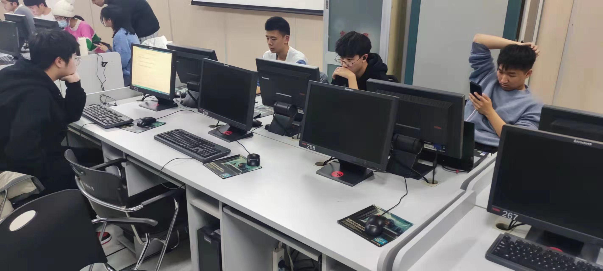
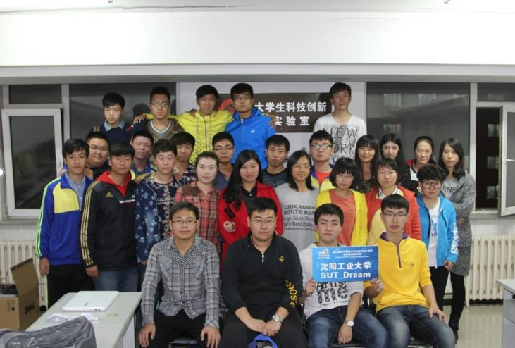
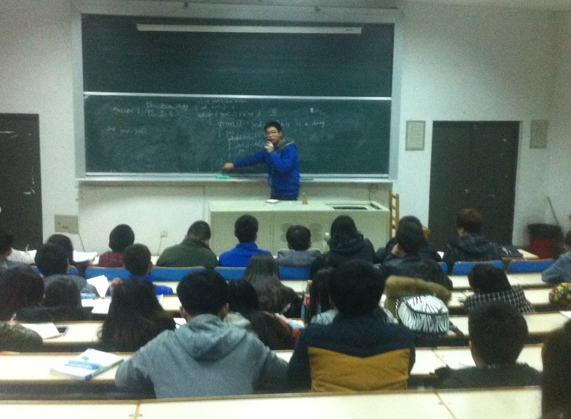
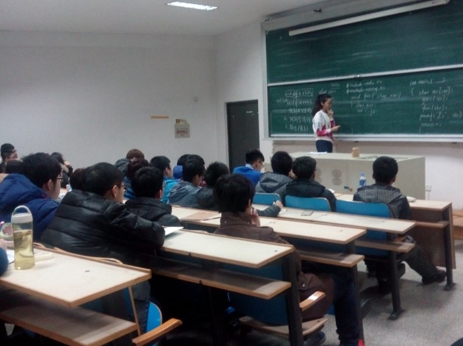
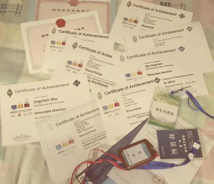
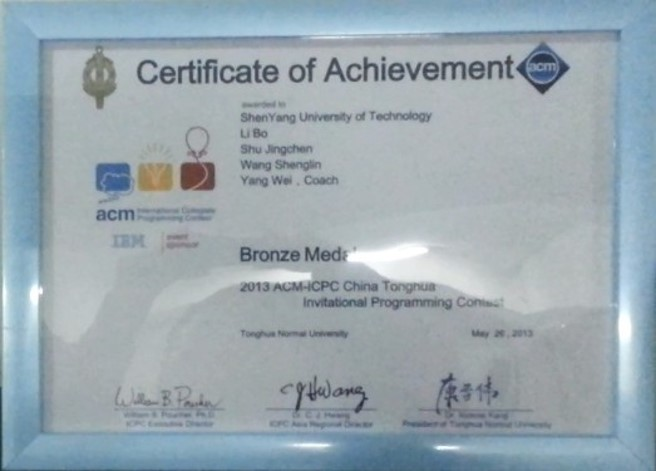
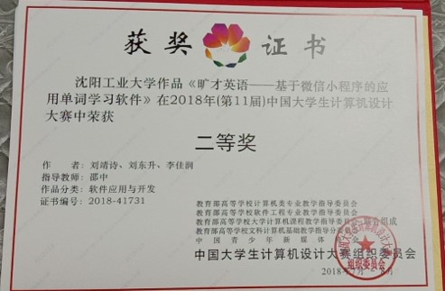
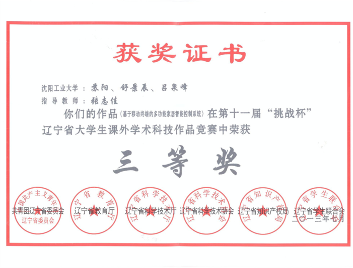
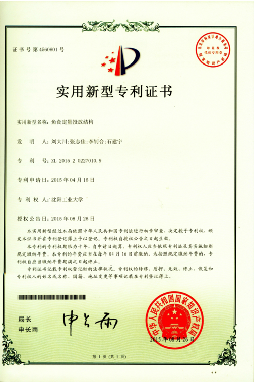

# 关于 USTIL

大学生科技创新实验室（USTIL，全称 **U**ndergraduate **S**cientific and **T**echnological **I**nnovation **L**aboratory）由舒景辰（现就职于阿里巴巴）于 2013 年创立，同年 9 月正式设立机构并开始招收第一批成员，并且在此后均以一年为周期招收新成员。本实验室由学生自主管理，自主教学，管理严格，拥有完整的考核制度。在此基础上，仅仅 5 年的时间，我们从一个仅有十台设备的小型实验室，发展成为一个拥有着数十台设备，百余名正式成员的大型实验室。2013 年至今，实验室共获得：国际级奖项三项，国家级奖项九项，省级奖项二十余项，校级奖上百项。同时，多次参加省大创年会，在科技论坛上代表学校进行演讲，获得了评委老师的一致好评。

## 图片展示

### 新址

### 原址

### 获奖

