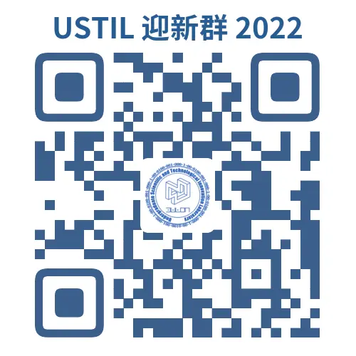

## 简介

USTIL（Undergraduate Scientific and Technological Innovation Laboratory）大学生科技创新实验室由舒景辰（现就职于阿里巴巴）于 2013 年创立，同年 9 月正式设立机构并开始招收第一批成员，并且在此后均以一年为周期招收新成员。实验室拥有自己建立的官网，包含博客、论坛、OJ 系统以及专业相关的书籍。本实验室由学生自主管理，学院教授讲师进行指导，管理严格，拥有完整的考核制度。在完备的管理制度下，仅仅 5 年的时间，我们从一个仅有 10 台设备的小型实验室，发展成为一个拥有着数十台设备，百余名正式成员，且有几百人接受过实验室培训，数百人接受过实验室公开课的大型实验室。2013 年至今，实验室共获得：国际级奖项 3 项，国家级奖项 9 项，省级奖项二十余项，校级奖上百项。同时，多次参加省大创年会，在科技论坛上代表学校进行演讲，获得了评委老师的一致好评。

## 加入方式

USTIL 招新对象为所有软件学院新生，报名并通过考核后即可加入，详情请进入 QQ 群咨询。

## 联系我们

QQ 群号：593766962

QQ 群二维码：

